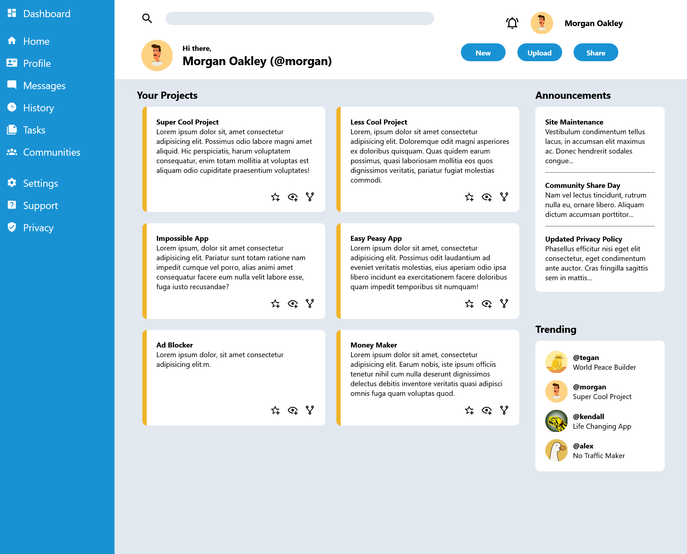

# Admin Dashboard

A responsive, grid-based Admin Dashboard built as part of The Odin Project’s Intermediate HTML and CSS Course.
This project demonstrates the use of CSS Grid, modular layout design, and semantic HTML to create a clean and functional dashboard interface.

# Project Overview

The goal of this project was to build a complete dashboard layout using CSS Grid as the main layout tool.
It replicates the structure of a typical admin panel, including:

- A sidebar with navigation and branding

- A header with a search bar, user information, and utility buttons

- A main content area displaying projects, announcements, and trending items

The focus of this assignment was on layout design rather than functionality, helping to strengthen understanding of grid-based page architecture.

# Features

- Modular grid layout for sidebar, header, and main content

- Nested grids for detailed internal alignment

- Customizable color palette, typography, and icons

- Semantic HTML for accessibility and maintainability

- Flexible sizing using fr units and minmax()

# How to Run Locally

Clone the repository:

    git clone https://github.com/<your-username>/admin-dashboard.git

Navigate into the project folder:

    cd Admin-Dashboard

Open the project in your browser:

    open index.html
